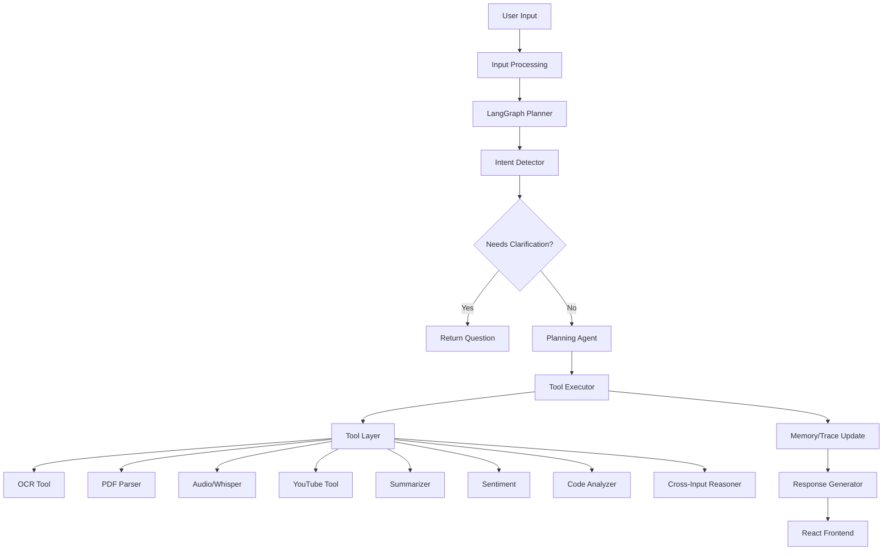

# Universal Multi-Modal Agent

An autonomous AI agent capable of accepting **text**, **images**, **PDFs**, and **audio** — individually or together — to understand intent, plan minimal tool execution, and return synthesized text responses.

## Architecture



### Flow

```
User → Input Processing → Planner Agent → Tool Selection → Tool Execution → Memory Update → Response Generator → Frontend
```

The LLM **never** performs extraction directly. All extraction is handled by dedicated tools.

## Project Structure

```
backend/
  app/
    api/          # FastAPI routes & dependencies
    agents/       # Agent orchestrator
    graph/        # LangGraph workflow & nodes
    tools/        # Independent tool classes
    services/     # LLM, file, trace, input services
    models/       # Domain models
    schemas/      # API schemas
    prompts/      # Prompt templates
    config/       # Settings
    utils/        # Helpers
    tests/        # Pytest tests
frontend/
  src/
    components/   # React UI components
    lib/          # API client & utilities
docker/
  Dockerfile.backend
  Dockerfile.frontend
  nginx.conf
docs/
render.yaml
docker-compose.yml
```

## Tools

| Tool | Purpose | Library |
|------|---------|---------|
| OCR | Extract text from images | EasyOCR |
| PDF Parser | Extract PDF text + OCR fallback | PyMuPDF |
| Audio | Transcribe audio | Whisper |
| YouTube | Fetch video transcripts | youtube-transcript-api |
| Summarizer | 1-line, 3-bullet, 5-sentence summaries | LLM |
| Sentiment | Label, confidence, justification | LLM |
| Code Analyzer | Language detection, bugs, complexity | LLM |
| Cross-Input Reasoner | Combine multi-tool outputs | LLM |

## Installation

### Prerequisites

- Python 3.12+
- Node.js 20+
- [uv](https://github.com/astral-sh/uv) package manager
- FFmpeg (for audio processing)

### Backend

```bash
cd backend
cp .env.example .env
# Edit .env with your OPENAI_API_KEY

uv pip install -e ".[dev]"
uvicorn app.main:app --reload --host 0.0.0.0 --port 8000
```

### Frontend

```bash
cd frontend
npm install
npm run dev
```

Open http://localhost:5173

## Environment Variables

| Variable | Description | Default |
|----------|-------------|---------|
| `OPENAI_API_KEY` | OpenAI (or compatible) API key | — |
| `OPENAI_BASE_URL` | API base URL | `https://api.openai.com/v1` |
| `MODEL_NAME` | LLM model name | `gpt-4o-mini` |
| `WHISPER_MODEL` | Whisper model size | `base` |
| `INTENT_CONFIDENCE_THRESHOLD` | Clarification threshold | `0.65` |
| `MAX_RETRIES` | Tool retry count | `3` |
| `MAX_UPLOAD_SIZE_MB` | Max file upload size | `50` |

## API Endpoints

| Method | Path | Description |
|--------|------|-------------|
| `GET` | `/api/v1/health` | Health check |
| `GET` | `/api/v1/tools` | List available tools |
| `POST` | `/api/v1/upload` | Upload file |
| `POST` | `/api/v1/chat` | Send chat message |
| `POST` | `/api/v1/analyze` | Analyze with optional streaming |
| `GET` | `/api/v1/trace/{id}` | Get execution trace |

Interactive docs: http://localhost:8000/docs

## Deployment

### Docker Compose

```bash
# Set environment variables
export OPENAI_API_KEY=your-key

docker compose up --build
```

- Backend: http://localhost:8000
- Frontend: http://localhost:3000

### Render

Deploy using the included `render.yaml`:

```bash
# Connect your repo to Render and it will use render.yaml
```

## Demo Walkthrough

1. **Text Q&A** — Type a question and get an answer
2. **Image OCR** — Upload a screenshot; ask "Extract text from this image"
3. **PDF Summary** — Upload a PDF; ask "Summarize this document"
4. **Audio Transcription** — Upload an audio file; ask "Transcribe this"
5. **YouTube Summary** — Paste a YouTube URL; ask "Summarize this video"
6. **Code Analysis** — Paste code in a markdown block; ask "Explain this code"
7. **Sentiment** — Paste text; ask "Analyze the sentiment"
8. **Mixed Input** — Upload PDF + audio + text prompt for cross-input reasoning
9. **Clarification** — Upload a PDF without instructions; agent asks what to do

## Screenshots

> Placeholder: Add screenshots of the chat UI, tool execution panel, and dark mode here.

## Testing

```bash
cd backend
pytest app/tests/ -v
```

Tests cover:
- Image OCR (missing file handling)
- Audio transcription (missing file handling)
- PDF extraction (missing file handling)
- Summary generation
- Code explanation
- Cross-input reasoning
- YouTube extraction
- Clarification flow
- API health & tools endpoints

## Code Quality

- Type hints throughout
- Dependency injection via FastAPI Depends
- Structured logging
- Pydantic models for validation
- Black + Ruff formatting/linting
- SOLID principles with independent tool classes

## License

MIT
