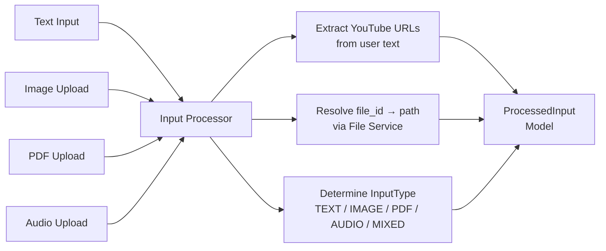
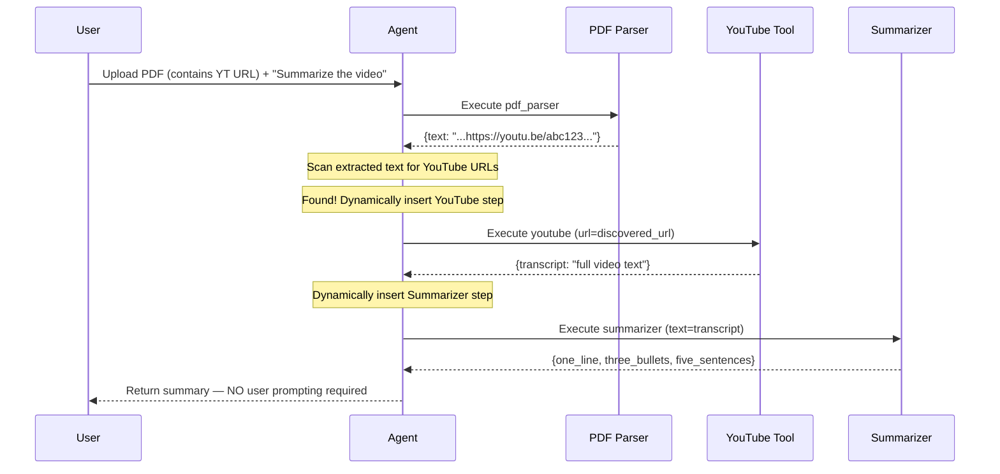
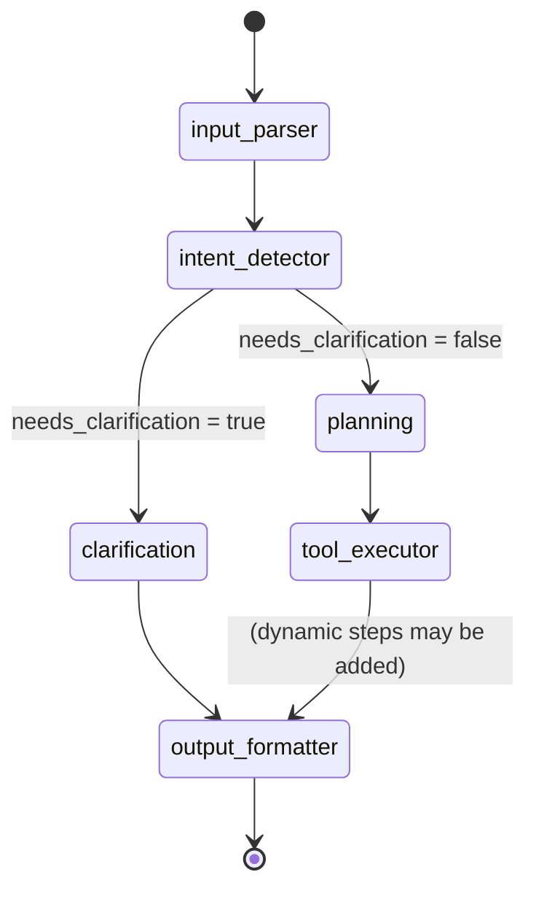

# Architecture — Universal Multi-Modal Agent

## System Overview

The Universal Multi-Modal Agent is a fully autonomous pipeline that accepts any combination of text, images, PDFs, and audio files, understands the user's goal, plans the minimal set of tools needed, executes them in sequence (with dynamic plan extension for discovered content like embedded YouTube URLs), and returns synthesized text responses.

---

## High-Level Architecture

```mermaid
flowchart TB
    subgraph INPUT ["Input Layer"]
        U[User Input\nText + Files] --> UP[File Upload\nPOST /api/v1/upload]
        UP --> FS[(File Store\n/tmp/uploads)]
        U --> CH[Chat / Analyze\nPOST /api/v1/chat\nor /analyze?stream=true]
    end

    subgraph AGENT ["Agent Core (LangGraph)"]
        CH --> IP[Input Processor\nExtract YT URLs,\nResolve file paths]
        IP --> ID[Intent Detector\nLLM + Rule-based\nConfidence scoring]
        ID -->|confidence < 0.65| CL[Clarification Node\nReturn question to user]
        ID -->|confidence ≥ 0.65| PL[Planning Node\nBuild minimal tool plan]
        PL --> TE[Tool Executor\nSequential execution\n+ Dynamic YT discovery]
        TE --> OF[Output Formatter\nSynthesize final answer\nToken + cost estimate]
        CL --> OF
    end

    subgraph TOOLS ["Tool Registry (8 Tools)"]
        TE --> OCR[OCR Tool\nEasyOCR]
        TE --> PDF[PDF Parser\nPyMuPDF + OCR fallback]
        TE --> AUD[Audio Tool\nWhisper (thread pool)]
        TE --> YT[YouTube Tool\nyoutube-transcript-api]
        TE --> SUM[Summarizer\n1-line + 3-bullets + 5-sent]
        TE --> SENT[Sentiment\nLabel + confidence + reason]
        TE --> CODE[Code Analyzer\nLanguage + bugs + complexity]
        TE --> CIR[Cross-Input Reasoner\nMulti-source synthesis]
    end

    subgraph FRONTEND ["Frontend (React + Vite)"]
        OF --> SSE[SSE Stream\nplan_step events]
        SSE --> UI[Chat UI\nPremium glass design]
        UI --> TEP[Tool Execution Panel\nLive step visualization]
        UI --> ETP[Extracted Text Panel\nWith copy button]
        UI --> RP[Reasoning Panel\nStep-by-step trace]
    end

    subgraph INFRA ["Infrastructure"]
        UI -.-> NGINX[nginx\nReverse proxy]
        NGINX -.-> FAST[FastAPI + Uvicorn\nPort 8000]
        FAST -.-> DOCKER[Docker Compose\nor Render.com]
    end
```

---

## Input Pipeline Detail



---

## Dynamic YouTube URL Discovery (Test Case 4)



---

## Tool Registry

| Tool | Name | Library | Input | Output |
|------|------|---------|-------|--------|
| OCR | `ocr` | EasyOCR | `file_path` | `{text, confidence, regions}` |
| PDF Parser | `pdf_parser` | PyMuPDF + OCR fallback | `file_path` | `{text, page_count, pages_with_ocr}` |
| Audio | `audio_transcription` | OpenAI Whisper (async) | `file_path` | `{transcript, language, duration_seconds, confidence}` |
| YouTube | `youtube` | youtube-transcript-api | `url` | `{transcript, video_id, language, available}` |
| Summarizer | `summarizer` | Cerebras LLM | `text, context` | `{one_line, three_bullets, five_sentences}` |
| Sentiment | `sentiment` | Cerebras LLM | `text` | `{label, confidence, justification}` |
| Code Analyzer | `code_analyzer` | Cerebras LLM | `code` | `{language, explanation, bugs, time_complexity}` |
| Cross-Input Reasoner | `cross_input_reasoner` | Cerebras LLM | `tool_outputs, extracted_texts, user_question` | `{unified_answer, key_insights, sources_used, reasoning_chain}` |

---

## LangGraph Workflow State



---

## Key Design Decisions

1. **LLM never extracts content directly** — All OCR, PDF parsing, audio transcription, and YouTube fetching uses dedicated deterministic tools. The LLM only performs reasoning, summarization, and synthesis.

2. **Dynamic plan extension** — After extracting PDF or image content, the `tool_executor_node` scans extracted text for YouTube URLs and automatically inserts YouTube + Summarizer steps into the live execution plan without any user interaction.

3. **Async-safe audio** — Whisper's CPU-bound `transcribe()` runs in a thread pool via `asyncio.run_in_executor` to prevent blocking FastAPI's event loop.

4. **Clarification gate** — If intent confidence is below 0.65 or `requires_clarification` is set, the agent pauses and asks a specific question before executing any tools.

5. **Cost estimator** — Every response includes `token_estimate` and `cost_estimate_usd` computed from tiktoken counts and configurable per-token pricing.

6. **Streaming** — SSE events are emitted for `start`, `input_processed`, `plan_step` (per tool), `tool_trace`, and `complete` — enabling the frontend to show a live execution timeline.
